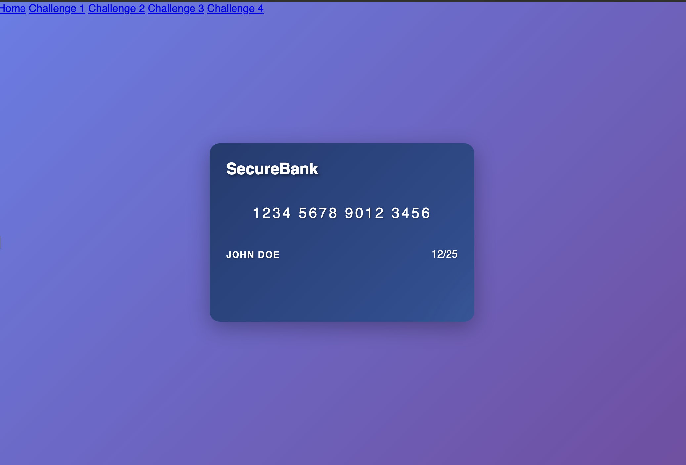

# CSS Challenge Task - Banking Theme

You are going to try to solve as much tasks as possible. It's a **Banking Styling Marathon**

## Instructions

1. Fork and clone this repo
2. You will find a folder for each challenge
3. The `index.html` for each challenge is already there, you do not need to create it.
4. Import your `CSS` only using a `style` sheet for each folder separately
5. **Use live server to run the server**, otherwise, some pages will break!
6. Remember that here we are using w3css, and it has some ready classes. If your style doesn't apply to the html just make sure yours is overriding the w3css.

## Challenge 1 - Bank Card Design

1. You will be adding your code in the `index.html` that is inside folder 1
2. Create style.css file and link it to your html file
3. Try to create this layout:

   **Expected Output:** A centered bank card with:

   - Bank name "SecureBank" at the top
   - Card number "1234 5678 9012 3456" in the middle
   - Cardholder name "JOHN DOE" at the bottom
   - Expiry date "12/25" in the bottom right
   - Blue gradient background
   - White text with shadow

### Hints and Tools:

- Bank card background image can be found in the `assets` folder
- To center text you can use `text-align`
- You can get fonts from [Google Fonts](https://fonts.google.com/). You can use any fonts you like for the title.
- Research how you can use google fonts in your HTML website!

## Challenge 2 - ATM Login Screen

1. You will be adding your code in the `index.html` that is inside folder 2
2. Create style.css file and link it to your html file
3. Try to create this layout:

   **Expected Output:** A centered ATM login form with:

   - Welcome message
   - PIN input field
   - Enter button
   - Animated colorful background
   - Shadow effect on the card

4. Use `flexbox`

### Hints and Tools:

- ATM background image is in the `assets` folder, use `background-image`
- Learn how you **center** elements in css [here](https://www.better.dev/centering-things-with-css-flexbox)
- To read more about `flexBox`, check [CSS Tricks](https://css-tricks.com/snippets/css/a-guide-to-flexbox/)
- To add shadow easily, use [this website](https://html-css-js.com/css/generator/box-shadow/) that provides you with the shadow css code.

  
  

## Challenge 3 - Account Balance Card

1. You don't need to touch `index.html` this time, just take a look of the classes that are assigned to each html element.
2. Your `style.css` has all classes that you need this time, you only need to fill the classes with your stylings.
3. Your page should look like a modern account balance display

**Expected Output:** An account balance card with:

- Account title and masked account number
- Large balance amount in green
- Three action buttons (Transfer, Deposit, Withdraw)
- Centered on page with shadow effects
- Hover effects on buttons and card

#### **The class `account-container`**

1. Use flexbox to center the card on the page
2. Set appropriate height and padding

#### **The class `account-card`**

1. Style the main card with background, padding, border-radius
2. Add box-shadow for depth
3. Set appropriate width

#### **The class `balance-amount`**

1. Make the balance large and prominent
2. Use green color for the amount
3. Add proper font styling

#### **The class `action-btn`**

1. Style the action buttons
2. Add hover effects
3. Use different colors for each button type

### Hints and Tools:

- `style.css` is ready with the classes
- Use `flexbox` for layout
- You can use this [coolors](https://coolors.co/) to find colors that you like
- Add `transition` property for smooth hover effects

## Challenge 4 - Bank Branch Card

1. You don't need to touch `index.html` this time, just take a look of the classes that are assigned to each html element.
2. Your `style.css` has all classes that you need this time, you only need to fill the classes with your stylings.
3. Reuse the image from challenge 1, to create a bank branch information card

**Expected Output:** A bank branch card with:

- Bank building image
- Branch name and address overlay
- Centered on the page
- Card shadow effect

4. Use `flexbox` for centering your card
5. You will be using `position` in couple of things

